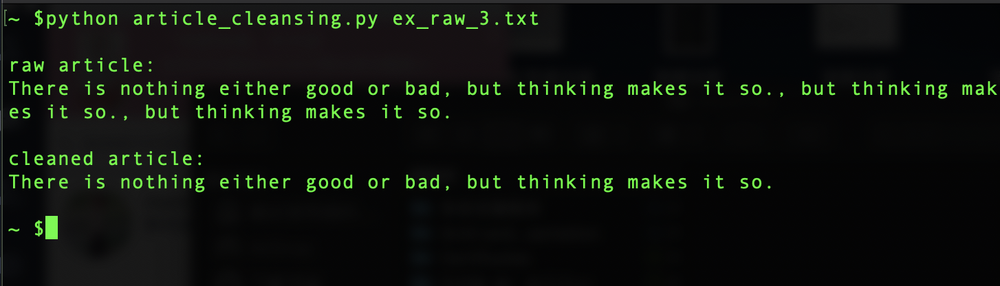

# article-cleansing
## Introduction
This job is to cleanse the articles containing arbitrary redundant paragraphs or sentences. It doesn't rearrange the order of the sentences in the article. The premise of this job is that the article needs to be structured with its correct beginning.

For example, there is an redundant article:
>There is nothing either good or bad, but thinking makes it so., but thinking makes it so., but thinking makes it so.

And the real article (also the expected output) is:
>There is nothing either good or bad, but thinking makes it so.

## Contribution
Reduced 40% capacity of corpus database

## Demo result
{:height="40px" width="15px"}

