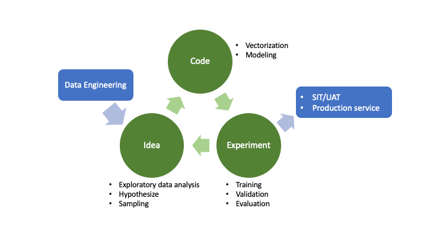
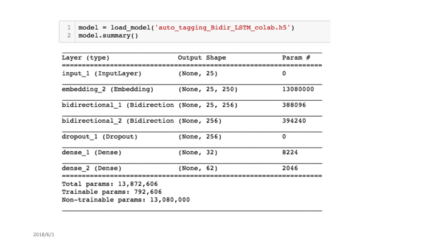
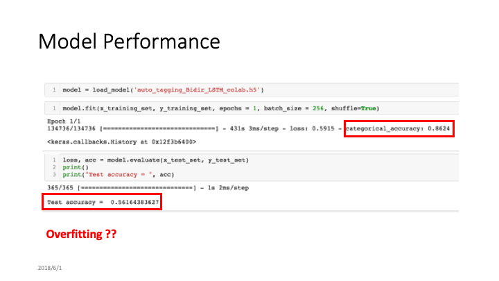
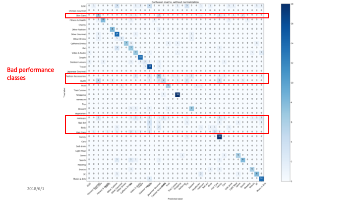
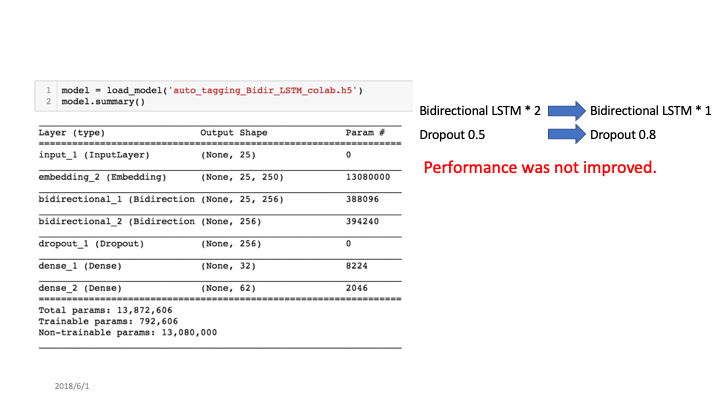
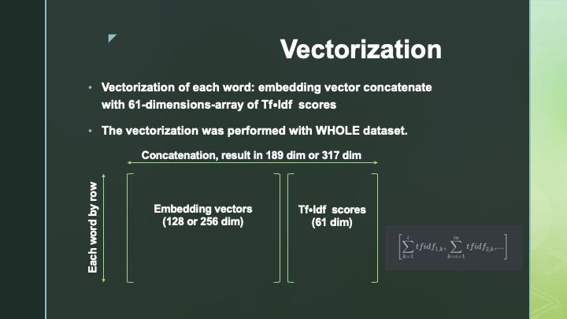
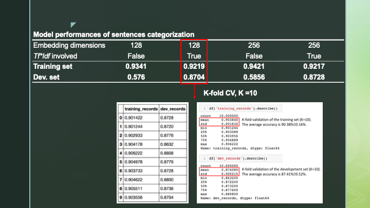
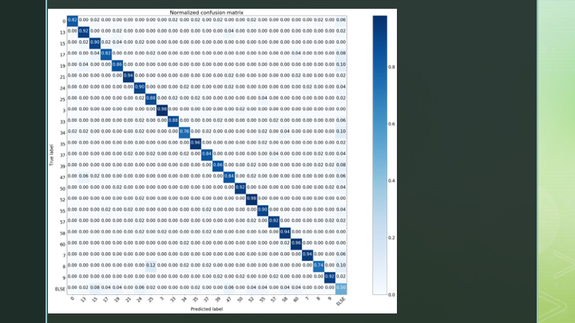
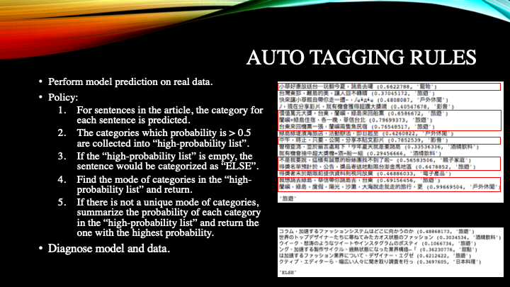

# Article Classifier (2018)

- Purpose: get customers profiling by their public posts for retail industry company.
- Key Features:
  - NLP model built by Keras with Tensorflow backend
  - Word embedding vector concatnate TFIDF scores

## Machine Learning Lifecycle

## Baseline

## Improvement

## Auto Tagging Method

