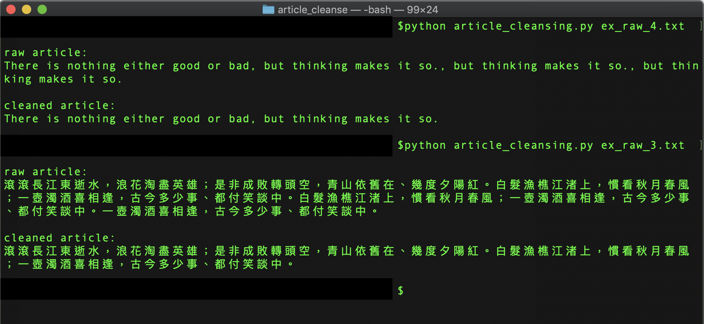

# article-cleansing
This job is to cleanse the articles containing arbitrary redundant paragraphs or sentences. It doesn't rearrange the order of the sentences in the article. The premise of this job is that the article needs to be structured with its correct beginning.

For example, there is an redundant article:
>There is nothing either good or bad, but thinking makes it so., but thinking makes it so., but thinking makes it so.

And the real article (also the expected output) is:
>There is nothing either good or bad, but thinking makes it so.

Another example (Mandarin):
>滾滾長江東逝水，浪花淘盡英雄；是非成敗轉頭空，青山依舊在、幾度夕陽紅。白髮漁樵江渚上，慣看秋月春風；一壺濁酒喜相逢，古今多少事、都付笑談中。白髮漁樵江渚上，慣看秋月春風；一壺濁酒喜相逢，古今多少事、都付笑談中。一壺濁酒喜相逢，古今多少事、都付笑談中。

And the real article (also the expected output) is:
>滾滾長江東逝水，浪花淘盡英雄；是非成敗轉頭空，青山依舊在、幾度夕陽紅。白髮漁樵江渚上，慣看秋月春風；一壺濁酒喜相逢，古今多少事、都付笑談中。

Demo result:

